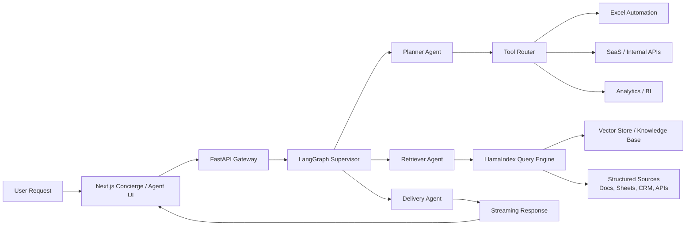

# Magic Architecture

## Data Flow



## Recommended Repository Structure

```text
magic/
├── apps/
│   └── web/
│       ├── app/
│       ├── components/
│       ├── lib/
│       └── public/
├── backend/
│   ├── app/
│   │   ├── api/
│   │   ├── core/
│   │   ├── graphs/
│   │   └── schemas/
│   └── pyproject.toml
├── agents/
│   └── workflows/
└── docs/
```

## Integration Notes

- `LangGraph` owns the state machine, retries, branching, and tool coordination.
- `LlamaIndex` plugs into the retriever node and can expose one or more query engines depending on domain.
- `FastAPI` streams node progress to the frontend so the agent showcase can reflect token flow and tool status in near real time.
- `Next.js` handles the premium brand layer, conversion surfaces, and future authenticated dashboards.

